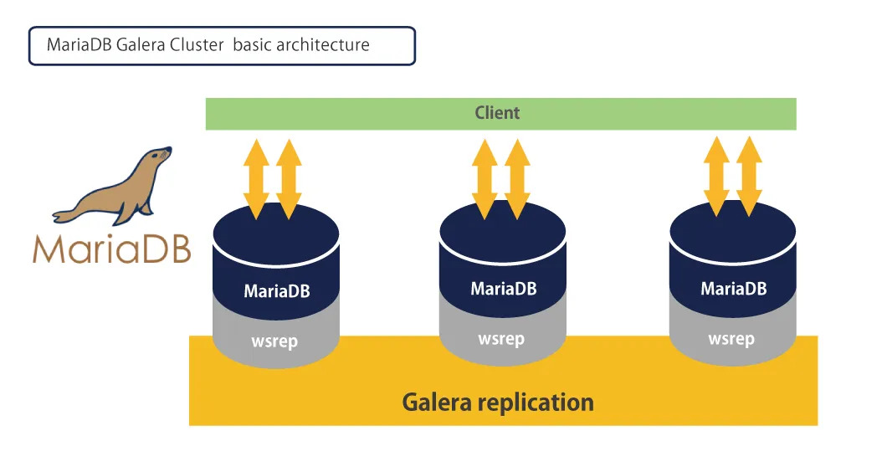
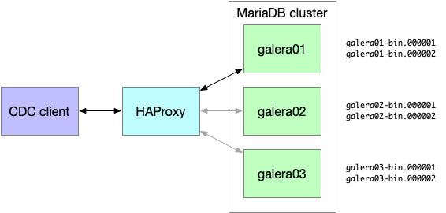
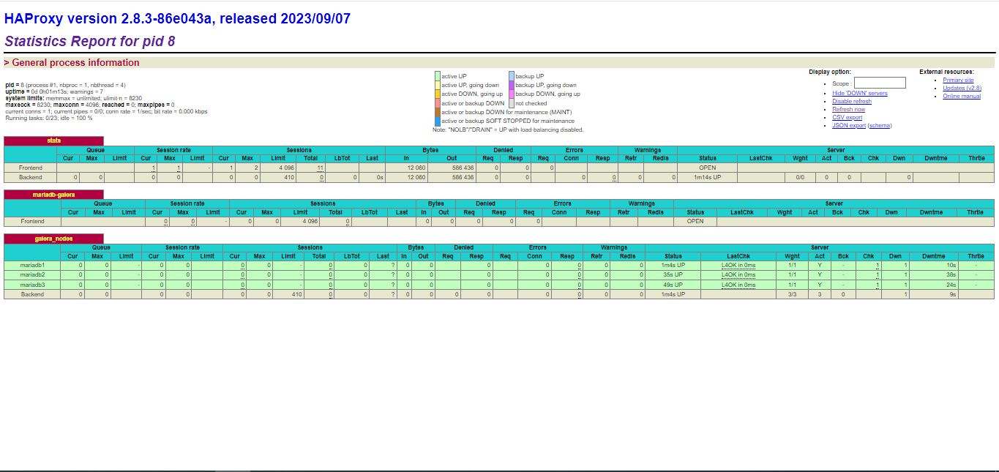

# Mariadb + Galera + Haproxy 

## What is Maria DB?

MariaDB is a secure, fast and relational database or RDBMS that uses the same familiar and reliable MySQL technology. In simpler words, we should say that MariaDB is a new branch of MySQL database and has all its positive features in full.


Of course, as you probably guessed, this new fork comes with great features and capabilities that will encourage many developers and programmers to use MariaDB.

The MariaDB database has multiple storage engines, supports more than 200,000 connections, and is completely open source. The performance speed of this database is 24% more than its parent database, MySQL, and this has been proven in various tests.

A very important thing to know about MariaDB is that this database is classified as one of the NewSQL databases. These new databases combine some of the most important features of NoSQL databases with the widely used features of relational databases. In this way, the final database has the highest performance and the best characteristics at the same time.

MariaDB has many similarities to MySQL and inherits its most important features. If you are now facing the question of why we need MariaDB despite MySQL, come with us to the next section to tell you the history of the creation of the MariaDB database and the reason for its creation.

# Galera Cluster




A concurrent multi-master database cluster based on concurrent replication and MySQL and InnoDB. When Galera Cluster is in use, database reads and writes can be directed to any node. Each individual node can be lost without interrupting operations and without using complex failover procedures.

At the top level, Galera Cluster consists of a database server (eg MySQL or MariaDB) that uses the Galera Replication plugin to manage replication. To be more precise, the MySQL replication plugin API has been extended to provide all the information and hooks needed for true Multi-Master concurrent replication. This extended API is called Write-Set Replication API or wsrep API.

# HAProxy


HE Proxy, which stands for High Availability Proxy, is a popular open source TCP/HTTP Load Balancer and proxy solution that can run on Linux, macOS, and FreeBSD. Its most common use is to improve the performance and reliability of a server environment by distributing the workload across multiple servers (eg web, application, database). It is used in many popular environments including: GitHub, Imgur, Instagram and Twitter.

# Using the Docker Compose file




```bash
version: "3"

services: 
 #mariadb-1
 mariadb1:
   image: mariadb:10.5
   container_name: mariadb1
   ports:
    - "3306:3306"
   env_file: .env
   environment:
    - MARIADB_USER=${MARIADB_USER_1}
    - MARIADB_PASSWORD=${MARIADB_PASSWORD_1}
    - MARIADB_DATABASE=${MARIADB_DATABASE_1}
    - MARIADB_ROOT_PASSWORD=${MARIADB_ROOT_PASSWORD}
   volumes:
    - ./mariadb1/galera.cnf:/etc/mysql/mariadb.conf.d/galera.cnf
   cap_add:
    - all
   networks:
    - app_net

 #mariadb-2
 mariadb2:
   image: mariadb:10.5
   container_name: mariadb2
   ports:
    - "3307:3306"
   env_file: .env   
   environment:
    - MARIADB_USER=${MARIADB_USER_2}
    - MARIADB_PASSWORD=${MARIADB_PASSWORD_2}
    - MARIADB_DATABASE=${MARIADB_DATABASE_2}
    - MARIADB_ROOT_PASSWORD=${MARIADB_ROOT_PASSWORD}
   volumes:
    - ./mariadb2/galera.cnf:/etc/mysql/mariadb.conf.d/galera.cnf
   cap_add:
    - all
   networks:
    - app_net

 #mariadb-2
 mariadb3:
   image: mariadb:10.5
   container_name: mariadb3
   ports:
    - "3308:3306"
   env_file: .env
   volumes:
    - ./mariadb3/galera.cnf:/etc/mysql/mariadb.conf.d/galera.cnf
   environment:
    - MARIADB_USER=${MARIADB_USER_3}
    - MARIADB_PASSWORD=${MARIADB_PASSWORD_3}
    - MARIADB_DATABASE=${MARIADB_DATABASE_3}
    - MARIADB_ROOT_PASSWORD=${MARIADB_ROOT_PASSWORD}
   cap_add:
    - all
   networks:
    - app_net

 #proxysql
 proxysql: 
   image: proxysql/proxysql:latest
   container_name: proxysql
   ports:
    - "6032:6032"
    - "6070:6070"
    - "6080:6080"
   cap_add:
    - all
   networks:
    - app_net

 haproxy:
    image: haproxy:latest
    container_name: haproxy
    volumes:
      - ./haproxy.cfg:/usr/local/etc/haproxy/haproxy.cfg
    ports:
      - "3000:3000"
    networks:
      - app_net
      - web_net

networks:
  web_net:
    external: true
  app_net:
```


After you create docker-compose.yml, you will create an env file with the credentials for MariaDB access, which you must put in the docker-compose file.


The contents of the env file are as below:

```bash
#mysql root password
MARIADB_ROOT_PASSWORD=Mariadb123123

#mariadb-1
MARIADB_USER_1=admin
MARIADB_PASSWORD_1=Mariadb123456
MARIADB_DATABASE_1=mariadb3

#mariadb-2
MARIADB_USER_2=mariadb
MARIADB_PASSWORD_2=Mariadb123456
MARIADB_DATABASE_2=mariadb3

#mariadb-3
MARIADB_USER_3=mariadb
MARIADB_PASSWORD_3=Mariadb123456
MARIADB_DATABASE_3=mariadb3
```

Now, you will have three MariaDB containers: mariadb1, mariadb2, and mariadb3. The name of each container confides the host for config of the Galera clusters. There are volumes to mount the config file Galera in the docker-compose file to each MariaDB container. As such, let’s create a Galera. cnf file in the mariadb1 folder.

## The contents of Galera. cnf on mariadb1 are below:

```bash
[galera]
wsrep_on                 = ON
wsrep_cluster_name       = "MariaDB Galera Cluster"
wsrep_provider           = /usr/lib/galera/libgalera_smm.so
wsrep_cluster_address    = "gcomm://"
binlog_format            = row
default_storage_engine   = InnoDB
innodb_autoinc_lock_mode = 2
bind-address = 0.0.0.0
wsrep_node_address="mariadb1"
```

After you create the Galera config on mariadb1, add Galera.cnf to mariadb2 folder.

## The following block contains the contents of Galera. cnf on mariadb2.

```bash
[galera]
wsrep_on                 = ON
wsrep_cluster_name       = "MariaDB Galera Cluster"
wsrep_provider           = /usr/lib/galera/libgalera_smm.so
wsrep_cluster_address    = "gcomm://mariadb1,mariadb2,mariadb3"
binlog_format            = row
default_storage_engine   = InnoDB
innodb_autoinc_lock_mode = 2
bind-address = 0.0.0.0
wsrep_node_address="mariadb2"
```

Lastly, add Galera. cnf to mariadb3 as well.

## Here are the contents of Galera. cnf file on mariadb3.

```bash
[galera]
wsrep_on                 = ON
wsrep_cluster_name       = "MariaDB Galera Cluster"
wsrep_provider           = /usr/lib/galera/libgalera_smm.so
wsrep_cluster_address    = "gcomm://mariadb1,mariadb2,mariadb3"
binlog_format            = row
default_storage_engine   = InnoDB
innodb_autoinc_lock_mode = 2
bind-address = 0.0.0.0
wsrep_node_address="mariadb3
```

Finally, all configs for mariadb1, mariadb2, and mariadb3 are complete. In the next section, you will learn how to deploy the Docker containe

#haproxy.cfg

```bash 

global
    log 127.0.0.1 local0
    maxconn 4096
    user haproxy
    group haproxy

defaults
    log global
    mode tcp
    option tcplog
    timeout connect 10s
    timeout client 30s
    timeout server 30s

listen stats
    bind *:3000
    mode http
    stats enable
    stats uri /
    stats refresh 2s

frontend mariadb-galera
    bind *:3306
    mode tcp
    option tcplog
    default_backend galera_nodes

backend galera_nodes
    option tcpka
    balance leastconn
    server mariadb1 mariadb1:3306 check
    server mariadb2 mariadb2:3306 check
    server mariadb3 mariadb3:3306 check

```

1- compose pull images  
2- docker network create web_net  
3- docker compose up -d


The following file should be changed after the containers are helsed

## The contents of Galera. cnf on mariadb1 are below:

```bash
[galera]
wsrep_on                 = ON
wsrep_cluster_name       = "MariaDB Galera Cluster"
wsrep_provider           = /usr/lib/galera/libgalera_smm.so
wsrep_cluster_address    = "gcomm://mariadb1,mariadb2,mariadb3"
binlog_format            = row
default_storage_engine   = InnoDB
innodb_autoinc_lock_mode = 2
bind-address = 0.0.0.0
wsrep_node_address="mariadb1"
```

1- docker compose up -d



